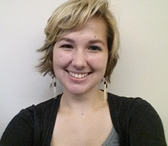

<link rel="stylesheet" href="http://al3xandr3.github.com/css/cv.css" type="text/css" media="screen, projection" />

| Name           | **Elizabeth Ozimek-Newman**
|---------------:|:---------------------------
| Address        | Florida
| Email          | elizabethozimeknewman@gmail.com
| Nationality    | Canadian
| Date of birth  | 03 January 1995
| Gender         | Female
| Website   		 | [https://github.com/vitamessor](https://github.com/vitamessor)

### Occupational field

> Computer Engineering Student

### Specialties
- Web Design
- Graphic Design

## Work experience

| Dates | **May 2013 - Now**
|-----------:|:-------------------------------------------
| Employer   | **StackFrame, LLC.**
| Occupation | Product Marketing Manager, Analytics (2006-2011)
| Contact    | http://www.stackframe.com/
| References | [Gene McCulley](http://www.linkedin.com/in/mcculley)

#### Main activities and responsibilities
- Commercial front end web developement.
- Search engine optimization for commercial sites while optimizing page load time.
- Complete web design overhaul.
- Graphic design.

## Education and training

| Dates      | **August 2013 - Present**
|-----------:|:-------------------------------
| School     | **University of Central Florida**
| Major      | Computer Engineering
| Contact    | http://www.ece.ucf.edu/

#### Courses
Introduction to Discrete Structures, Chemistry for Engineers, Calculus with Analytical Geometry

#### Involement
Historian and Event Planning Committee member for the University of Central Florida Association of Computing Machinery.

## Computer skills and competences

| Programming languages | HTML, CSS3, Java 
|-----------:|:------------------------------
| Data Tools | Excel, SQL
| Web Analytics |  Google Analytics
| Databases | MySql
| Github | [https://github.com/vitamessor/](https://github.com/vitamessor/) 

## Personal skills and competences

| Languages | English (fluent), French (basic),
|-----------:|:---------------------------
| Social skills | Have worked(& lived) abroad in multi-cultural environments 
| Driving licence | American driving license, Class B
